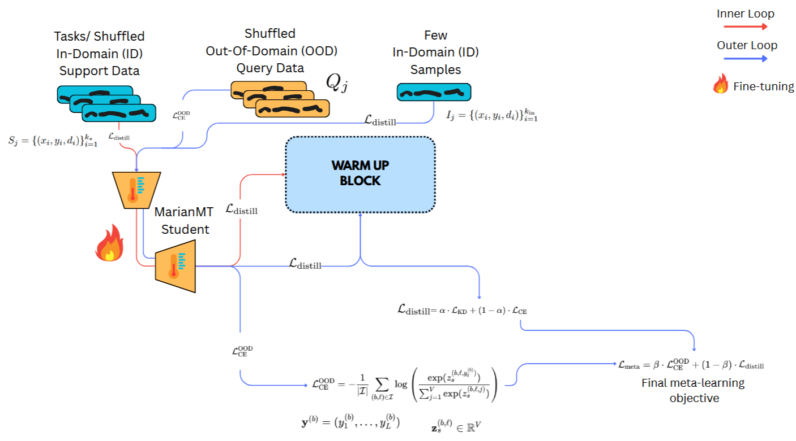

# Multi-Domain NMT 

## Project Description



Our main work aims to advance neural machine translation by developing a single model that achieves performance on par with domain-specific fine-tuned experts, while remaining readily adaptable to unseen domains via Model-Agnostic Meta-Learning (MAML) without compromising accuracy on previously encountered domains and thereby avoiding catastrophic forgetting. This approach is inspired by Zhong et al. who combined knowledge distillation from multiple domain-specialized experts with meta-learning for rapid adaptation, albeit in the image-processing context; our work extends this paradigm to textual data.

We employ a predefined set of domains from OPUS alongside the automotive data given—legal (ELRC-1076-EUIPO law), general (NeuLab-TedTalks), and medical (WMT-16 PubMed), each associated with a frozen expert model fine-tuned from the MarianNMT base. Initially, an aggregator network (a Transformer-based classifier) was introduced to route expert outputs to the student: the classifier’s softmax scores over domain labels weight the corresponding expert logits, and an attention mechanism combines these weighted logits into a unified representation. Although this soft-mixture strategy yields a modest performance gain over hard expert selection, our experimental results demonstrate that omitting the aggregator altogether simplifies training and ultimately delivers superior translation quality.


We employ a two-stage procedure to train a single "universal" student model capable of rapid adaptation to novel domains. In the warmup phase, we first distill knowledge from a pool of expert teachers into the student via sequence-level and token-level objectives similar to Kim & Rush.

## Training Execution (`main.py`)

The `main.py` script is responsible for executing the training process, which can operate in two main modes: a warmup phase and a meta-learning (MAML) phase. The script uses `argparse` to control the execution flow via the `--warmup` flag. Configuration details such as model paths, batch sizes, learning rates, and distillation parameters are loaded from `config.yml`.

### Key Components:
-   **Experts**: Pre-trained MarianMT models frozen during the training.
-   **Student Model**: A MarianMT model that learns from the experts and adapts through meta-learning.
-   **Aggregator**: A Transformer-based classifier (if used) to combine expert outputs.
-   **MetaSGD**: Utilized from the `learn2learn` library for the meta-learning updates.

### Usage:
To run the warmup phase:
```bash
python main.py --warmup True
```
To run the meta-learning phase (after warmup or if warmup is handled separately):
```bash
python main.py --warmup False
```

The script will manage the loading of expert and student models, data splitting, and the iterative training process.

## Core Modules (`_modules.py`)

The `_modules.py` file contains essential helper functions and classes that support the training and evaluation processes.

### Key Functionalities:
-   **Data Handling**:
    -   `load_and_freeze_experts`: Loads and freezes pre-trained MarianMT expert models.
    -   `load_student`: Loads the MarianMT student model.
    -   `load_and_split_data`: Splits datasets into training and testing sets for various domains.
    -   `build_samples`, `build_meta_batch`: Functions for constructing training samples and meta-batches for MAML.
    -   `DomainProcessing`: A class for processing dataset paths and extracting translations, including domain identification using Sentence Transformers.
-   **Model Wrappers**:
    -   `MarianMAMLWrapper`, `MarianLogits`, `MarianMAMLFeatures`: Custom `nn.Module` wrappers to adapt MarianMT models for MAML training, providing access to logits and features.
-   **Training Steps**:
    -   `train_step`: Implements the combined aggregator and knowledge distillation loss for the warmup phase.
    -   `train_step_query`: Computes the hybrid distillation loss for query sets in the MAML inner loop.
    -   `train_step_ood`: Calculates the out-of-domain loss during the MAML outer loop.
-   **Evaluation during Training**:
    -   `eval_epoch_aggregator`: Evaluates the aggregator's performance during its warmup.
    -   `evaluate_student_bleu`: Computes BLEU scores for the student model across different domains and for out-of-domain data.
-   **Utilities**:
    -   `infer_hidden_dim`: Infers the hidden dimension of the models.
    -   `pad_sequences`: Utility for padding sequences to a uniform length.
    -   `push_to_hub`: Facilitates pushing models to the Hugging Face Hub.

## Model Evaluation (`translation_model_evaluation.py`)

The `translation_model_evaluation.py` script is dedicated to evaluating the performance of translation models on held-out test sets. It supports various open-source models and uses a comprehensive suite of metrics.

### Supported Models:
-   `MarianNMTModel`: Interface for Helsinki-NLP's MarianMT models.

### Evaluation Metrics:
The script calculates the following metrics to assess translation quality:
-   **BLEU (Bilingual Evaluation Understudy)**: A precision-based metric for grammatical similarity.
-   **CHRF (Character n-gram F-score)**: A character-level metric robust to morphological variations.
-   **METEOR (Metric for Evaluation of Translation with Explicit Ordering)**: A recall-based metric that considers synonyms and paraphrases.
-   **BERTScore**: A semantic similarity metric that leverages pre-trained BERT embeddings.

### Usage:
The script reads source and reference translations from a CSV file (specified by `CSV_PATH`). It then translates the source texts using the configured models and computes the evaluation metrics. Results are printed to the console and saved to an output CSV file (`OUTPUT_FILE`).

To run the evaluation:
```bash
python translation_model_evaluation.py
```
Ensure that `CSV_PATH` and `OUTPUT_FILE` are correctly configured within the script or as command-line arguments if modifications are made.

### Configuration:
-   `CSV_PATH`: Path to the CSV file containing source and target (reference) translations (e.g., `test_set.csv`).
-   `MAX_SAMPLES`: Maximum number of samples to evaluate (can be set to `None` to evaluate all samples).
-   `OUTPUT_FILE`: Path to save the evaluation results in CSV format.
-   `BATCH_SIZE`: Batch size for translation to manage memory usage.
